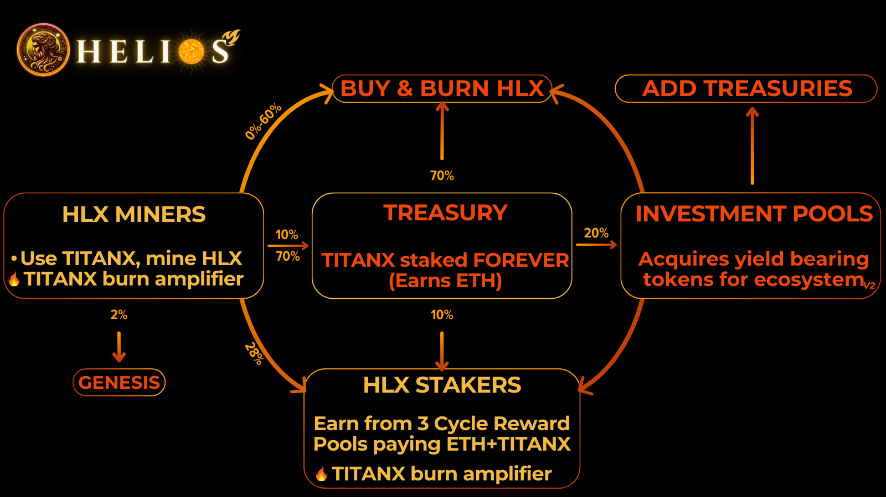

# Helios

## Project Overview
Helios is designed to revolutionize cryptocurrency mining by integrating the TitanX protocol, a system known for its supply reduction and buy-pressure mechanisms. Unlike traditional mining platforms that use ETH, Helios utilizes TITANX for mining operations, offering a unique approach to cryptocurrency participation and asset growth.


---

## Project Setup Guide
This document provides step-by-step instructions to set up and run the project locally.

### 🚀 Prerequisites

Before starting, make sure the following tools are installed on your system:

### 1. Git Installation
Download and install Git:
https://git-scm.com/install

To verify installation:
   ```bash
   git --version
   ```

### 2. Node Installation
Download and install Node.js:
https://nodejs.org/en/download

To verify installation:
   ```bash
   node --version
   ```
   ```bash
   npm --version
   ```

### ⚙️ Project Setup

### 1. Clone the Repository
Open Git Bash or terminal and run:
   ```bash
   git clone <project-url>
   ```
   ```bash
   cd <project-directory>
   ```
### 2. Install Dependencies
   ```bash
   npm install
   ```
### 3. Run the Project
   ```bash
   npm start
   ```